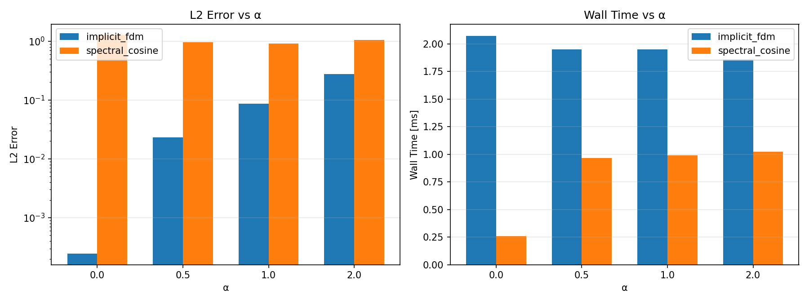
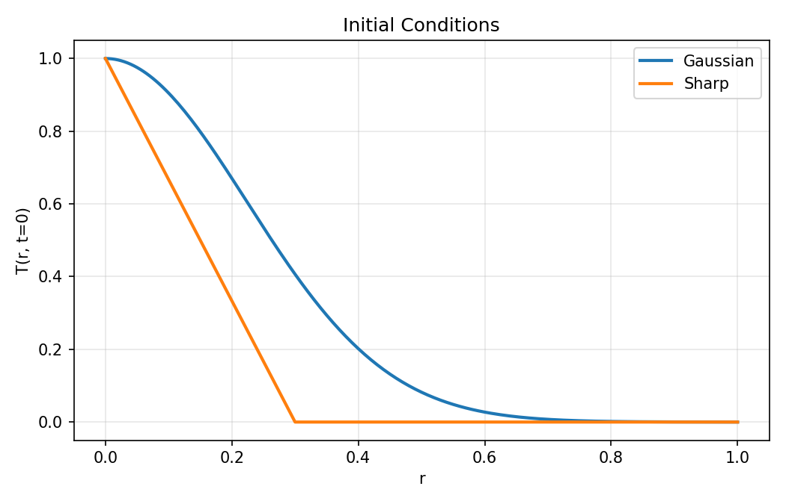
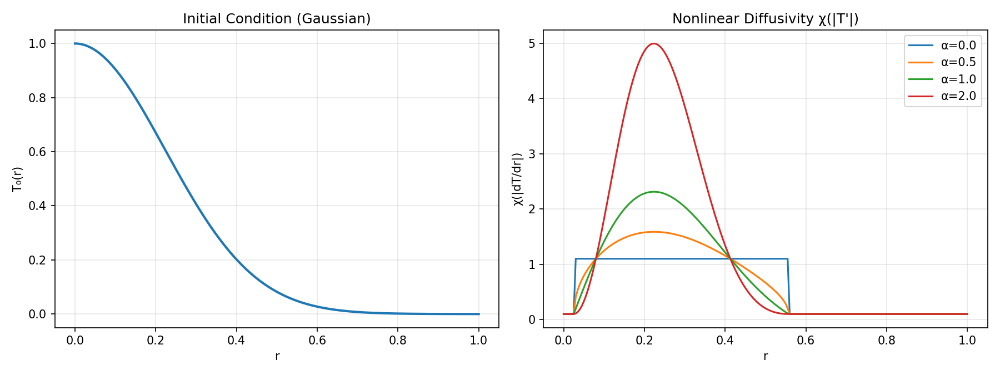
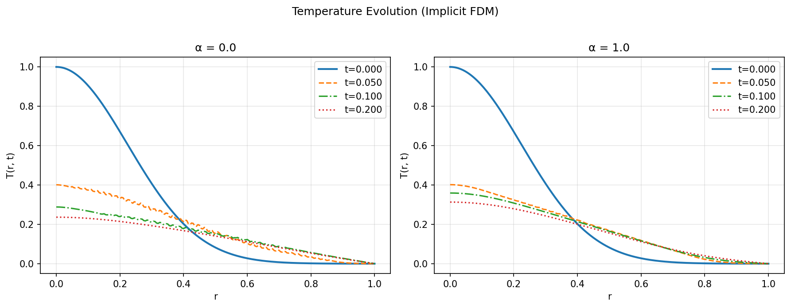
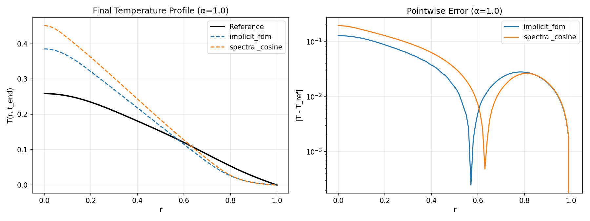

# Tutorial: Fusion Heat Transport PDE Benchmark

This tutorial walks through the full workflow — from running your first benchmark to training an ML solver selector and using incremental learning.

## Prerequisites

```bash
pip install -e ".[dev]"
```

Verify the installation:

```bash
make test
```

All 22 tests should pass.

---

## Part 1: Running a Basic Benchmark

### 1.1 Default run

Run the benchmark with default parameters (α = 0.0, 0.5, 1.0):

```bash
python -m app.run_benchmark
```

This will:
1. For each α value, compute a reference solution (implicit FDM with 4x refinement)
2. Run all three solvers (implicit FDM, cosine spectral, PINN stub)
3. Compute L2 and L∞ errors against the reference
4. Select the best solver by `score = L2_error + 0.1 × wall_time`
5. Write reports to `outputs/benchmark.csv` and `outputs/benchmark.md`

Example output:

```
Computing reference for alpha=0.0...
  Running implicit_fdm (alpha=0.0)...
    L2=0.130432, Linf=0.0486736, time=0.0024s
  Running spectral_cosine (alpha=0.0)...
    L2=0.203631, Linf=0.0652731, time=0.0024s
  Running pinn_stub (alpha=0.0)...
    L2=nan, Linf=nan, time=0.0003s

Best for alpha=0.0: implicit_fdm
```

The following chart shows L2 error and wall time for each solver across different α values:



Key observations:
- **implicit_fdm** consistently achieves the lowest L2 error across all α values
- **spectral_cosine** works for small α but becomes unstable for large α with the threshold-based χ
- **pinn_stub** returns NaN without PyTorch installed

### 1.2 Customizing parameters

Try different nonlinearity strengths:

```bash
python -m app.run_benchmark --alpha 0.0 1.0 2.0
```

Increase grid resolution for higher accuracy:

```bash
python -m app.run_benchmark --nr 101 --dt 0.0005
```

### 1.3 Inspecting results

Open the generated report:

```bash
cat outputs/benchmark.md
```

The CSV file is convenient for further analysis:

```bash
cat outputs/benchmark.csv
```

---

## Part 2: Understanding the PDE

The benchmark solves the 1D radial heat equation in cylindrical geometry:

```
∂T/∂t = (1/r) ∂/∂r (r χ ∂T/∂r)
```

where the thermal diffusivity has a threshold-based nonlinearity:

```
χ(|T'|) = (|T'| - 0.5)^α + 0.1    if |T'| > 0.5
χ(|T'|) = 0.1                       if |T'| ≤ 0.5
```

Key properties:
- **Threshold behavior**: diffusivity activates only when the gradient exceeds 0.5
- **α = 0**: Step-like diffusivity — 1.1 above threshold, 0.1 below
- **α > 0**: Gradual onset — enhanced diffusion grows as (|T'| - 0.5)^α above the threshold
- **Baseline**: χ = 0.1 everywhere (10× slower than standard diffusion with χ = 1)

This models anomalous transport in fusion plasmas, where transport is suppressed below a critical gradient and enhanced above it.

Boundary conditions:
- r = 0: Symmetry (∂T/∂r = 0)
- r = 1: Fixed wall temperature (T = 0)

The initial condition T₀(r) = 1 - r² is a parabola that naturally satisfies both boundary conditions: T₀(1) = 0 and dT₀/dr|_{r=0} = 0.



The nonlinear diffusivity χ activates only where |dT/dr| > 0.5. The α parameter controls how steeply χ rises above the threshold:



Note the step-like profile for α = 0.0 (blue) — χ jumps from 0.1 to 1.1 at the threshold. For α > 0, χ rises smoothly above the threshold.

The following figure shows how the temperature profile evolves over time. With α = 1.0 (right), the enhanced diffusion above the gradient threshold flattens the profile faster in steep-gradient regions:



### 2.1 Exploring with Python

```python
import numpy as np
from app.run_benchmark import make_initial, compute_reference

r = np.linspace(0, 1, 51)

# Initial condition: T₀ = 1 - r²
T0 = make_initial(r)
print(f"T(0)={T0[0]:.3f}, T(1)={T0[-1]:.6f}")  # T(0)=1.000, T(1)=0.000

# Compute solution for alpha=0.5
T_ref = compute_reference(T0, r, dt=0.001, t_end=0.1, alpha=0.5)
print(f"Solution shape: {T_ref.shape}")  # (time_steps+1, spatial_points)
print(f"Final center temperature: {T_ref[-1, 0]:.4f}")
```

### 2.2 Understanding χ in Python

You can inspect the diffusivity profile directly:

```python
from features.extract import gradient, chi

dTdr = gradient(T0, r)
print(f"Max |dT/dr|: {np.max(np.abs(dTdr)):.3f}")

# Compute chi for different alpha values
for alpha in [0.0, 0.5, 1.0, 2.0]:
    chi_vals = chi(dTdr, alpha)
    print(f"  alpha={alpha}: chi_min={chi_vals.min():.3f}, chi_max={chi_vals.max():.3f}")
```

### 2.3 Feature extraction

The `features/extract.py` module computes physical quantities from temperature profiles:

```python
from features.extract import extract_all

feats = extract_all(T0, r, alpha=0.5)
for k, v in feats.items():
    print(f"  {k}: {v:.4f}" if isinstance(v, float) else f"  {k}: {v}")
```

---

## Part 3: Comparing Solvers Programmatically

```python
import time
from solvers.fdm.implicit import ImplicitFDM
from solvers.spectral.cosine import CosineSpectral
from metrics.accuracy import compute_errors

r = np.linspace(0, 1, 51)
T0 = make_initial(r)
alpha = 0.5  # Use moderate alpha for stable comparison

# Reference solution
T_ref = compute_reference(T0, r, dt=0.001, t_end=0.1, alpha=alpha)

# Run each solver
for SolverClass in [ImplicitFDM, CosineSpectral]:
    solver = SolverClass()
    t0 = time.perf_counter()
    T_hist = solver.solve(T0.copy(), r, 0.001, 0.1, alpha)
    wall = time.perf_counter() - t0

    # Compare final profiles
    errs = compute_errors(
        np.stack([T_hist[0], T_hist[-1]]),
        np.stack([T_ref[0], T_ref[-1]]),
        r
    )
    print(f"{solver.name}: L2={errs['l2']:.6g}, time={wall:.4f}s")
```

The figure below shows the final temperature profile and pointwise error for α = 1.0. The implicit FDM solver closely tracks the reference, while the spectral solver shows larger deviations due to the threshold-based χ:



> **Note**: The spectral solver can become numerically unstable for large α with the new χ formula, since the explicit nonlinear correction step may amplify errors near the gradient threshold. The implicit FDM solver handles this robustly because it solves the full system implicitly.

---

## Part 4: ML Solver Selector

Instead of running all solvers every time, you can train a decision tree to predict the best solver from problem parameters alone.

### 4.1 Generate training data

Run a parameter sweep over many combinations of α, grid size, time step, etc.:

```bash
python -m app.run_benchmark --generate-data
```

This creates `data/training_data.csv` with ~216 rows. Each row contains:
- 12 features (problem parameters + initial condition properties)
- The label: which solver scored best

The sweep covers:
- α: 0.0, 0.1, 0.2, 0.5, 0.8, 1.0, 1.5, 2.0
- nr: 31, 51, 71
- dt: 0.0005, 0.001, 0.002
- t_end: 0.05, 0.1, 0.2

Inspect the data:

```bash
head -5 data/training_data.csv
```

### 4.2 Train the model

```bash
python -m policy.train --data data/training_data.csv
```

Or use the Makefile shortcut (generates data + trains in one step):

```bash
make train
```

The training output shows accuracy on the training set:

```
Training accuracy: XX.X% (XXX/XXX)
Model saved to data/solver_model.npz
```

### 4.3 Use the ML selector

Now instead of running all solvers, predict the best one and run only that:

```bash
python -m app.run_benchmark --use-ml-selector --alpha 1.5
```

Compare with the full benchmark (runs all 3 solvers):

```bash
python -m app.run_benchmark --alpha 1.5
```

The ML selector should pick the same solver that the full benchmark identifies as best.

### 4.4 Understanding the features

The ML model uses 12 features extracted before solving:

| Category | Feature | What it measures |
|----------|---------|------------------|
| Problem | `alpha` | Nonlinearity exponent |
| Problem | `nr`, `dt`, `t_end` | Discretization parameters |
| Physical | `max_abs_gradient` | Steepest gradient in T₀ — determines if χ threshold (0.5) is exceeded |
| Physical | `energy_content` | Total thermal energy ∫T₀·r·dr |
| Physical | `max_chi` | Peak diffusivity at t=0 — reflects threshold activation |
| Physical | `max_laplacian` | Peak curvature in T₀ |
| Physical | `T_center` | Central temperature |
| Derived | `gradient_sharpness` | max_abs_gradient / T_center |
| Derived | `chi_ratio` | max_chi / min_chi — how strongly the threshold activates |
| Derived | `problem_stiffness` | α × max_gradient — nonlinear difficulty |

These features capture the "difficulty" of the problem without solving it. In particular, `max_abs_gradient` relative to the threshold 0.5 determines whether the nonlinear regime is active, and `chi_ratio` measures how strong the nonlinear effect is.

---

## Part 5: Incremental Learning with `--update`

The model can improve over time by accumulating results from each benchmark run.

### 5.1 Initial setup

Start with the base training data:

```bash
make train
```

### 5.2 Run benchmarks with `--update`

Each `--update` run appends new data and retrains:

```bash
# Run with a new parameter combination and update the model
python -m app.run_benchmark --alpha 0.3 --update

# Try another combination
python -m app.run_benchmark --alpha 1.2 --nr 71 --dt 0.0005 --update
```

Example output:

```
Computing reference for alpha=0.3...
  Running implicit_fdm (alpha=0.3)...
    ...
Best for alpha=0.3: implicit_fdm

Appended 1 samples to data/training_data.csv
Retraining model...
Training accuracy: XX.X% (XXX/XXX)
Model saved to data/solver_model.npz
```

### 5.3 Verify improvement

After accumulating more data, test the ML selector:

```bash
python -m app.run_benchmark --use-ml-selector --alpha 0.3
```

The model now has direct experience with this parameter combination.

### 5.4 Typical workflow

```bash
# Day 1: Initial setup
make train

# Day 2: Explore new parameters, model learns from each run
python -m app.run_benchmark --alpha 0.0 0.5 1.0 --update
python -m app.run_benchmark --alpha 0.3 0.7 1.5 --update

# Day 3: Use ML selector for fast runs
python -m app.run_benchmark --use-ml-selector --alpha 0.7
python -m app.run_benchmark --use-ml-selector --alpha 1.3

# Periodically verify: does ML match full benchmark?
python -m app.run_benchmark --alpha 0.7
```

---

## Part 6: Adding a New Solver

To add your own solver to the benchmark:

### 6.1 Implement the solver

Create a new file (e.g., `solvers/your_method/solver.py`):

```python
import numpy as np
from solvers.base import SolverBase

class YourSolver(SolverBase):
    name = "your_solver"

    def solve(self, T0, r, dt, t_end, alpha):
        """
        Args:
            T0: Initial temperature profile (1D array)
            r: Radial grid points (1D array, 0 to 1)
            dt: Time step
            t_end: Final time
            alpha: Nonlinearity parameter

        Returns:
            T_history: 2D array (n_timesteps+1, n_grid_points)

        Note: Use self.chi(dTdr, alpha) to compute the diffusivity.
              This returns (|dTdr|-0.5)^alpha + 0.1 where |dTdr|>0.5,
              and 0.1 otherwise.
        """
        nsteps = int(t_end / dt)
        T = T0.copy()
        history = [T.copy()]

        for _ in range(nsteps):
            # Your time-stepping logic here
            T = self._step(T, r, dt, alpha)
            history.append(T.copy())

        return np.array(history)
```

### 6.2 Register in the benchmark

Add your solver to the solver lists in `app/run_benchmark.py`:

```python
from solvers.your_method.solver import YourSolver

solvers = [ImplicitFDM(), CosineSpectral(), PINNStub(), YourSolver()]
```

### 6.3 Retrain the ML model

After adding a new solver, regenerate training data so the ML selector can learn when to pick it:

```bash
python -m app.run_benchmark --generate-data
python -m policy.train
```

### 6.4 Add tests

Add tests in `tests/test_solvers.py`:

```python
from solvers.your_method.solver import YourSolver

def test_your_solver_basic():
    solver = YourSolver()
    r = np.linspace(0, 1, 51)
    T0 = 1.0 - r**2
    T_hist = solver.solve(T0, r, 0.001, 0.01, alpha=0.0)
    assert T_hist.shape[0] == 11  # 10 steps + initial
    assert T_hist.shape[1] == 51
```

---

## Appendix: The Diffusivity Formula

The nonlinear diffusivity in this project has a threshold structure:

```
χ(|T'|) = (|T'| - 0.5)^α + 0.1    if |T'| > 0.5
χ(|T'|) = 0.1                       if |T'| ≤ 0.5
```

This is implemented in two places:
- `features/extract.py:chi()` — for feature extraction
- `solvers/base.py:SolverBase.chi()` — used by all solvers

The formula has the following physical interpretation:

| Regime | Condition | χ value | Meaning |
|--------|-----------|---------|---------|
| Sub-threshold | \|T'\| ≤ 0.5 | 0.1 | Slow background diffusion |
| Threshold | \|T'\| = 0.5 | 0.1 | Activation point |
| Super-threshold | \|T'\| > 0.5 | (|T'|-0.5)^α + 0.1 | Enhanced transport |

The parameter α controls the steepness of the enhancement:
- **α = 0**: χ jumps to 1.1 immediately above threshold (step function)
- **α = 0.5**: χ grows as √(|T'| - 0.5), moderate onset
- **α = 1**: χ grows linearly above threshold
- **α = 2**: χ grows quadratically — strong enhancement for large gradients

---

## Summary of Commands

| Command | Description |
|---------|-------------|
| `make test` | Run all tests |
| `make benchmark` | Run benchmark with defaults |
| `make train` | Generate training data + train ML model |
| `make clean` | Remove generated outputs |
| `python -m app.run_benchmark --alpha 0.5 1.0` | Benchmark with custom α |
| `python -m app.run_benchmark --generate-data` | Generate ML training data |
| `python -m app.run_benchmark --use-ml-selector --alpha 1.5` | Predict & run best solver |
| `python -m app.run_benchmark --alpha 0.5 --update` | Benchmark + update model |
| `python -m policy.train` | Train model from existing data |
| `python -m policy.train --generate` | Generate data + train |
| `python docs/generate_figures.py` | Regenerate tutorial figures |
| `python docs/generate_slides.py` | Regenerate presentation slides |
